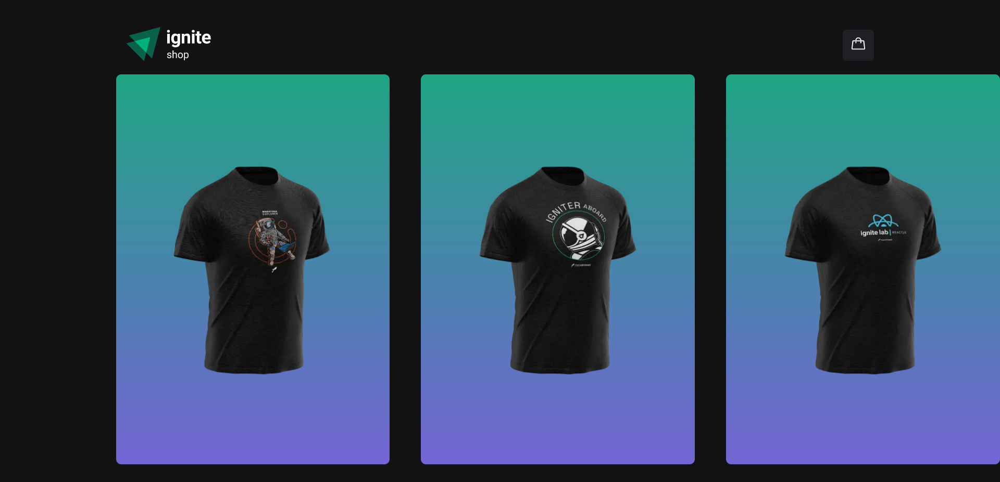
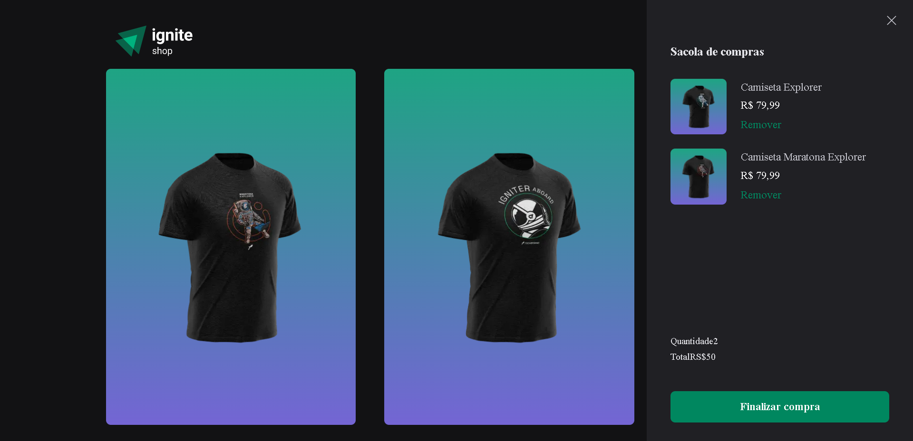

# ignite Shop

<div align="center">
	
  
</div>

## :dart: Objetivo

Desafio 04 do conteúdo estudado nas aulas do Chapter IV da trilha de React do
Bootcamp Ignite da Rocketseat.

## :hammer_and_wrench: Ferramentas

- [@phosphor-icons/react](https://github.com/phosphor-icons/react)
- [axios](https://www.npmjs.com/package/axios)
- [immer](https://immerjs.github.io/immer/)
- [keen-slider](https://keen-slider.io/)
- [next](https://nextjs.org/)
- [radix-ui](https://www.radix-ui.com/)
- [stripe](https://stripe.com/br)
- [stitches](https://stitches.dev/)
- [typescript](https://www.typescriptlang.org/)

## :desktop_computer: Padronização de código

- [Eslint](https://eslint.org/)
- [Prettier](https://prettier.io/)
- [EditorConfig](https://editorconfig.org/)

## :rocket: Executando o projeto

```bash
// Instale as dependências

yarn install

// Concluindo a instalação rode

yarn dev
```
